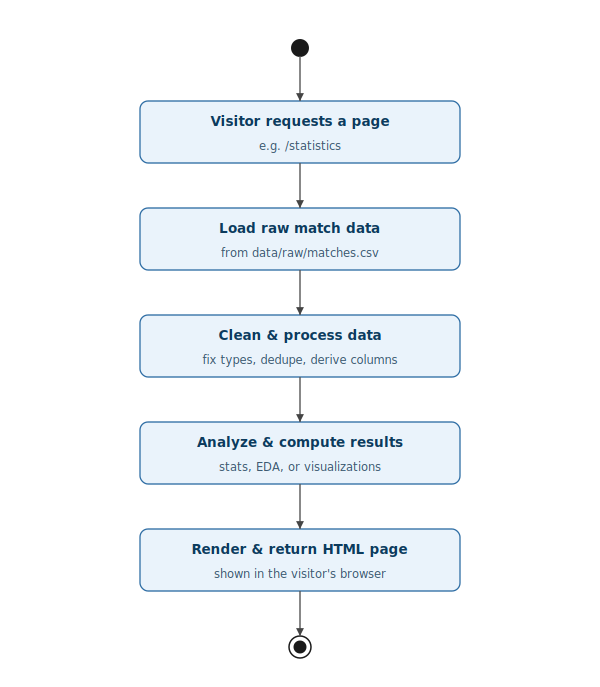
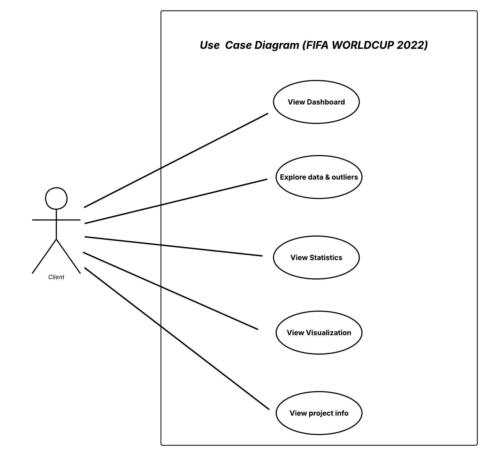
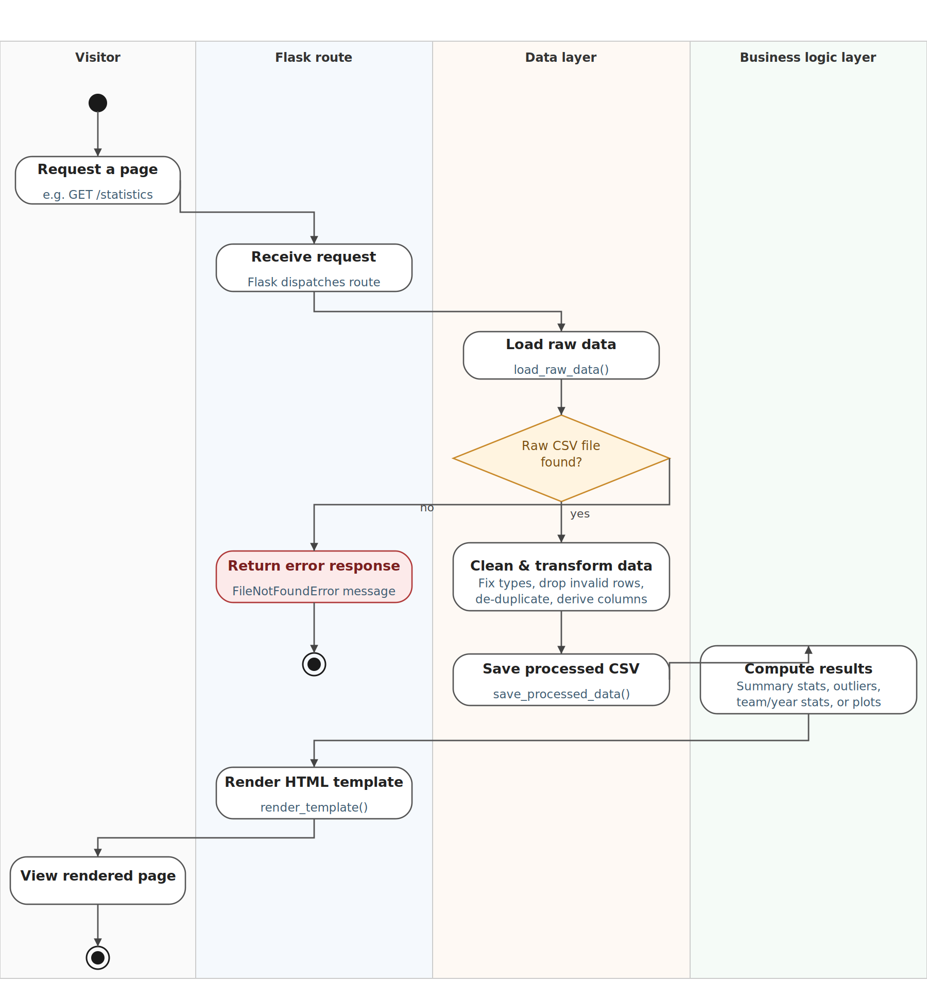
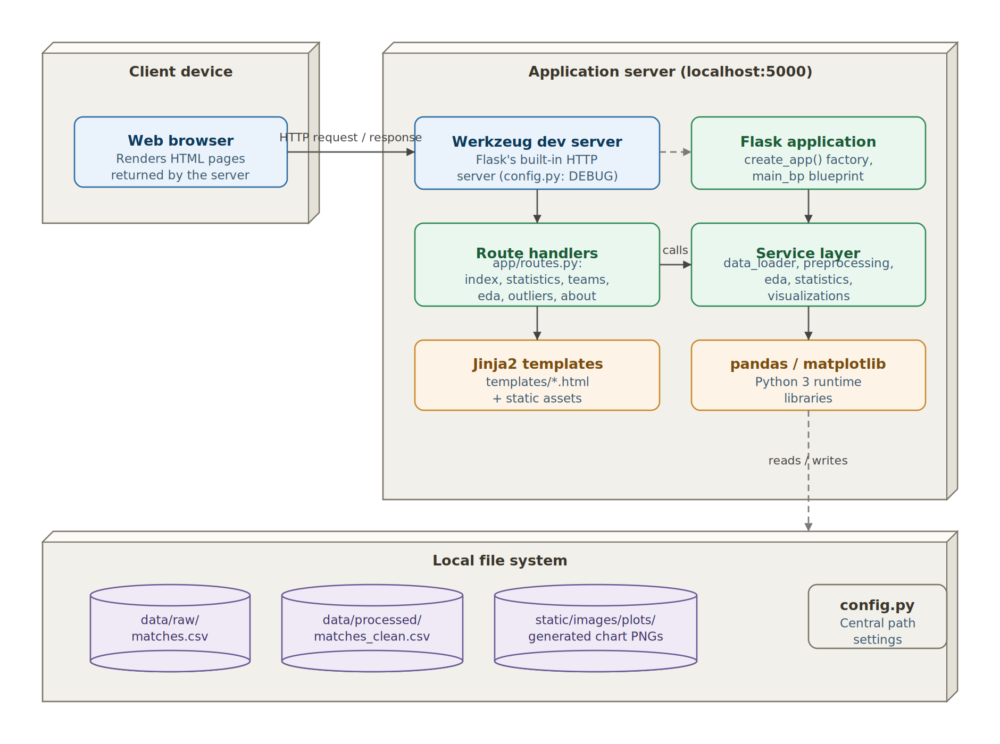

# System_Workflow

The diagram illustrates the workflow of a web application that processes data and displays results to the user. The process begins when a visitor requests a webpage, such as the **/statistics** page. The application then loads the raw match data from a CSV file (`data/raw/matches.csv`). After loading the data, it performs data cleaning and preprocessing by correcting data types, removing duplicate records, and creating any necessary derived columns to ensure the dataset is accurate and ready for analysis. Once the data has been prepared, the application analyzes it by calculating statistics, performing exploratory data analysis (EDA), or generating visualizations. Finally, the processed results are inserted into an HTML template, and the completed webpage is returned to the user's browser, allowing them to view the requested statistics and insights. This workflow ensures that users receive accurate, up-to-date, and well-presented information based on the underlying dataset.

# **Use Case Diagram: -**

The use case diagram represents the main functionalities available to a **client** in the **FIFA World Cup 2022 Dashboard** system. The client is the primary actor who interacts with the application to access different features. After entering the system, the client can **view the dashboard**, which provides an overview of the FIFA World Cup 2022 data and highlights key insights. The client can also **explore data and outliers** to examine the dataset in more detail, identify unusual values, and better understand the data distribution. Additionally, the client can **view statistics**, which display important numerical summaries such as goals, matches, teams, player performance, or other tournament metrics. The **view visualization** feature enables the client to interact with graphical representations of the data, including charts and plots, making trends and patterns easier to interpret. Finally, the client can **view project information**, where details about the project, dataset, objectives, and methodology are presented. Overall, the use case diagram illustrates how a client interacts with the system to access analytical information, visualizations, and project details through a simple and user-friendly interface.

# Activity Diagram: -

The activity diagram illustrates the workflow of the **FIFA World Cup 2022 web application**, showing how a user's request is processed through different system layers: **Visitor**, **Flask Route**, **Data Layer**, and **Business Logic Layer**. The process begins when a visitor requests a webpage, such as the **/statistics** page. The request is received by the Flask route, which dispatches it to the appropriate function. The application then enters the data layer, where it attempts to load the raw CSV dataset using the `load_raw_data()` function. A decision is made to check whether the raw CSV file exists. If the file is not found, the system immediately returns an error response with a **FileNotFoundError** message, and the process ends. If the file is available, the application cleans and transforms the data by correcting data types, removing invalid and duplicate records, and creating derived columns. The processed data is then saved using the `save_processed_data()` function. Next, the business logic layer computes the required results, such as summary statistics, outlier detection, team or yearly analysis, and data visualizations. Finally, these results are passed back to the Flask route, which renders an HTML template using the `render_template()` function. The generated webpage is then sent to the visitor's browser, allowing the user to view the processed statistics and visualizations. This workflow demonstrates how the application efficiently handles requests, processes data, manages errors, and delivers analytical results through a web interface.

# Deployment diagram: -

The deployment diagram illustrates the overall architecture of the **FIFA World Cup 2022 Dashboard** web application and shows how its different components interact to process user requests. The process begins on the **client device**, where a user accesses the application through a **web browser**. The browser sends an HTTP request to the **Werkzeug development server**, which is Flask's built-in web server running on **localhost:5000**. The Werkzeug server forwards the request to the **Flask application**, created using the `create_app()` factory and the `main_bp` blueprint. The request is then handled by the appropriate **route handlers** (such as `index`, `statistics`, `teams`, `EDA`, `outliers`, and `about`), which determine the requested functionality. These route handlers communicate with the **service layer**, responsible for loading data, preprocessing it, performing exploratory data analysis (EDA), generating statistics, and creating visualizations. The service layer uses Python libraries such as **Pandas** and **Matplotlib** to process the dataset and generate charts. The application reads the raw dataset from **`data/raw/matches.csv`**, saves the cleaned dataset as **`data/processed/matches_clean.csv`**, and stores generated chart images in **`static/images/plots/`**. Application settings are managed through the **`config.py`** configuration file. Finally, the processed data is passed to **Jinja2 templates**, which generate dynamic HTML pages that are returned to the web browser. This architecture separates presentation, business logic, and data processing into different layers, making the application modular, maintainable, and easier to extend.